# Giving Technical Teams Superpowers with AI

## Slide 1

Giving Technical Teams 
Superpowers with AI
Selcuk Atli - selcuk.atli@gmail.com

---

## Slide 2

Introduction
I am a Fulbright Scholar and serial entrepreneur with a BS and MS in 
Computer Science. 
SocialWire
An advertising platform acquired 
by Rakuten.
Boostable
A Y Combinator–backed 
advertising tool for marketplace 
sellers that was acquired by 
Metric Collective.
Bunch
A group video chat app for multiplayer games that reached over 10 million 
downloads and raised more than $35 million from investors such as 
General Catalyst, EA, Take-Two, Ubisoft, Tencent, Riot Games, Supercell, and 
others.

---

## Slide 3

AI Native Coding for 18+ months
Early Adopter of Cursor
Been using Claude Code since March '25 (since launch).
Can ship 1-2 Products per Month
Rapidly delivering 1-2 new products monthly by leveraging AI-assisted development for accelerated iteration and 
deployment.
90%+ of our Code is AI Generated
Leveraging AI throughout the entire development lifecycle, from initial concept to final review.

---

## Slide 4

Three ways to build with AI

---

## Slide 5

Vibe Coding
For non-technical roles (PMs, designers, marketers):
Tools like Lovable & Replit turn ideas into prototypes.
Accelerates communication & iteration.
Ideation without code, rapid prototyping.

---

## Slide 6

Code Assist
For developers who primarily hand-code:
AI tools (e.g., GitHub Copilot) assist with code 
completion, refactoring, and debugging.
Developers write 50%+ of code, retaining control.
Enhances productivity without full abstraction.

---

## Slide 7

AI-native Coding
For technical teams:
Tools (e.g., Cursor, Claude Code) transform 
workflows.
Output & iteration speed increase 5–10x.
Fewer people tackle complex systems quickly.
Engineering with AI at its core, not just 
prompting.

---

## Slide 8

AI Native Coding
is generating 90%+ of the code, 
while still being in the technical details.

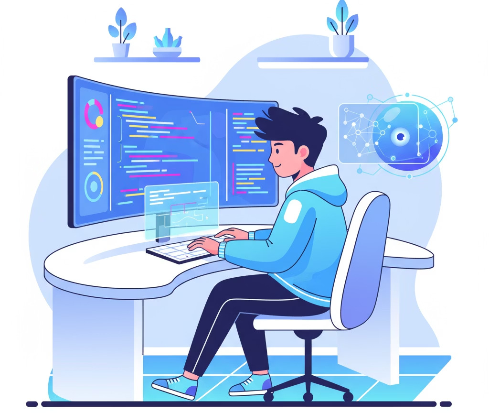

---

## Slide 9

Categories of Coding Tools
01
IDEs
Examples: Cursor, Antigravity, VSCode
Cursor: Good agentic development features, agent mode offers 
a great way to work with multiple agents in parallel. 
Antigravity: New IDE released by Google, good agent mode, 
works well with Gemini 3.0 pro model from Google. 
VSCode: Most IDEs like Cursor and AntiGravity fork VSCode, 
minimal agentic experience. 
02
Terminals
Example: Warp, Ghostty
Warp supports agentic features, has good UX and works across 
Mac, Windows and Linux 
Ghostty is a popular minimal terminal
03
Agents
Examples: Claude Code, Codex, Gemini

---

## Slide 10

Recommended AI-Native Coding Setup
Terminal
Utilize a modern terminal like Warp as 
your primary interface. Its robust features 
and tab management make it an ideal 
hub for your AI-native workflow.
Open Tabs for AI Agents
Open multiple tabs within Warp, 
dedicating each to an AI agent like 
Claude Code or Codex. This allows for 
focused interaction, problem-solving, 
and efficient code generation.
IDE for Review & Edit
Leverage your preferred IDE (e.g., Cursor, 
VS Code) for final code review, 
debugging, and direct edits. This setup 
ensures human oversight while 
maximizing AI assistance.
This streamlined setup integrates your AI agents directly into your terminal workflow, allowing you to quickly switch between AI-driven 
generation and traditional code editing for optimal efficiency.

---

## Slide 11

Why Warp > PowerShell/Traditional 
Terminals for AI Agents
Built-in AI Agent Mode
Natural language detection local.
Seamless delegation to AI agents.
Step-by-step collaboration with 
approve/adjust.
Context attachment for error fixing.
Modern UX for Agent Workflows
Block-based navigation.
IDE-like editing, multi-line 
commands.
Smart auto-complete for 400+ CLI 
tools.
Inline editing anywhere.
Cross-Platform Shell Support
Switch between PowerShell, Git 
Bash, WSL instantly.
Works on Windows, Mac, and Linux.
No setup or configuration hassle.
Team Knowledge Integration (Warp Drive)
Share runbooks, workflows, and commands.
Standardize AI agent processes across teams.
Templatized commands for repeated tasks.
Performance & Technology
Built in Rust for exceptional speed.
Modern rendering engines (DirectX, Metal).
Faster than traditional terminals.

---

## Slide 12

Best Practices: 
Working with Agents

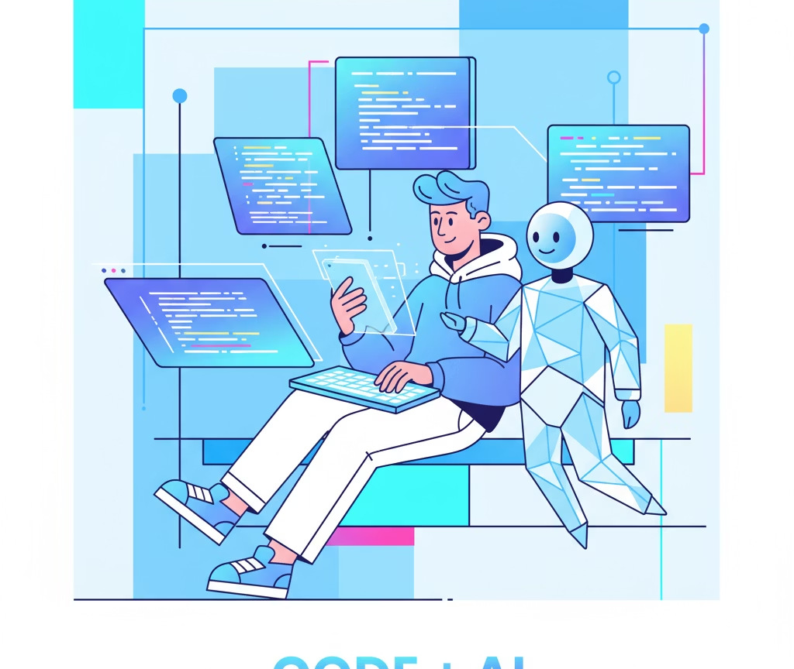

---

## Slide 13

Working with Claude Code
(Note: the following features are specific to Claude Code)
npm install -g @anthropic-
ai/claude-code
Installation
Install Claude Code globally 
before launching:
Launch
Run claude code in your project 
directory.
VSCode Extension
Claude Code can also be accessed directly within VSCode via the official 
extension, eliminating the need to switch between terminal and IDE.

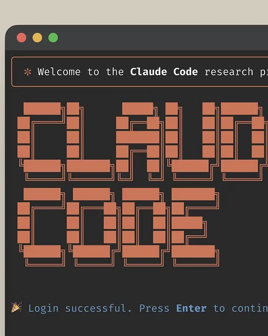

---

## Slide 14

Agents work through your code, just like a developer 
would
This approach ensures agents are adaptable and efficient, mirroring human developer workflows.
Search, Grep files and folders
Agents efficiently search and grep your 
codebase for relevant information.
Read documentation
They read documentation, architectural 
rules, and specific instructions.
Access tools to get things done
Agents leverage available tools to 
execute tasks and achieve objectives.

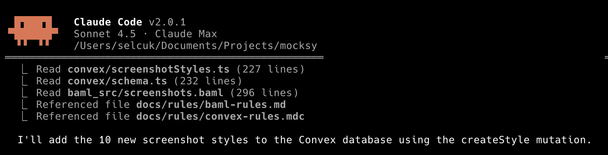

---

## Slide 15

Claude Code: Accept Edits and Plan Mode
Accept Edits
In Claude Code, you can use accept edits to quickly approve AI-
proposed changes. This keeps you in control while maintaining 
development velocity.
Plan Mode
Use plan mode to have the agent outline its approach before 
acting. This ensures alignment before execution and prevents 
costly mistakes. It generally helps to plan and review the agent's 
proposal, give feedback, and iterate until it's what you want.
To efficiently navigate and switch between different modes in Claude Code, press Shift + Tab.

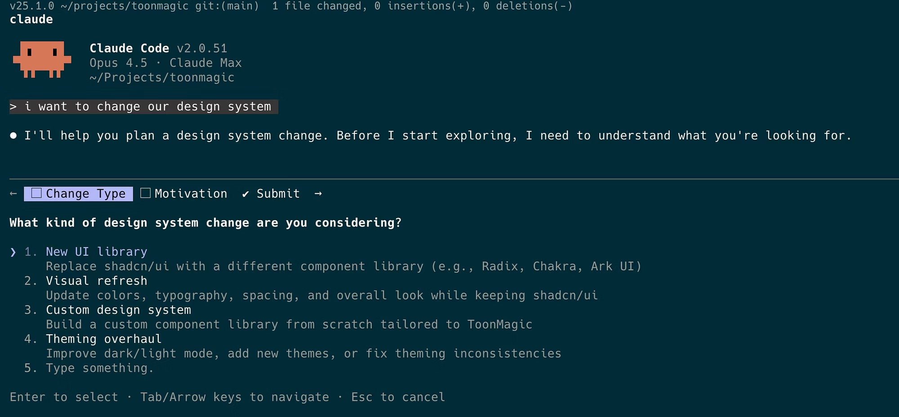

---

## Slide 16

Organize your code to make it 
easier for agents
Organizing your codebase, file names, and folders is crucial. Tag files and 
folders in Cursor or terminal agents for better context.
Clear File Naming
Use descriptive, consistent 
naming conventions that help 
agents understand file purposes 
at a glance.
Logical Folder Structure
Group related functionality 
together in folders that reflect 
your application architecture.
Context Tags
Tag important files and folders so agents can quickly identify key 
components of your system.

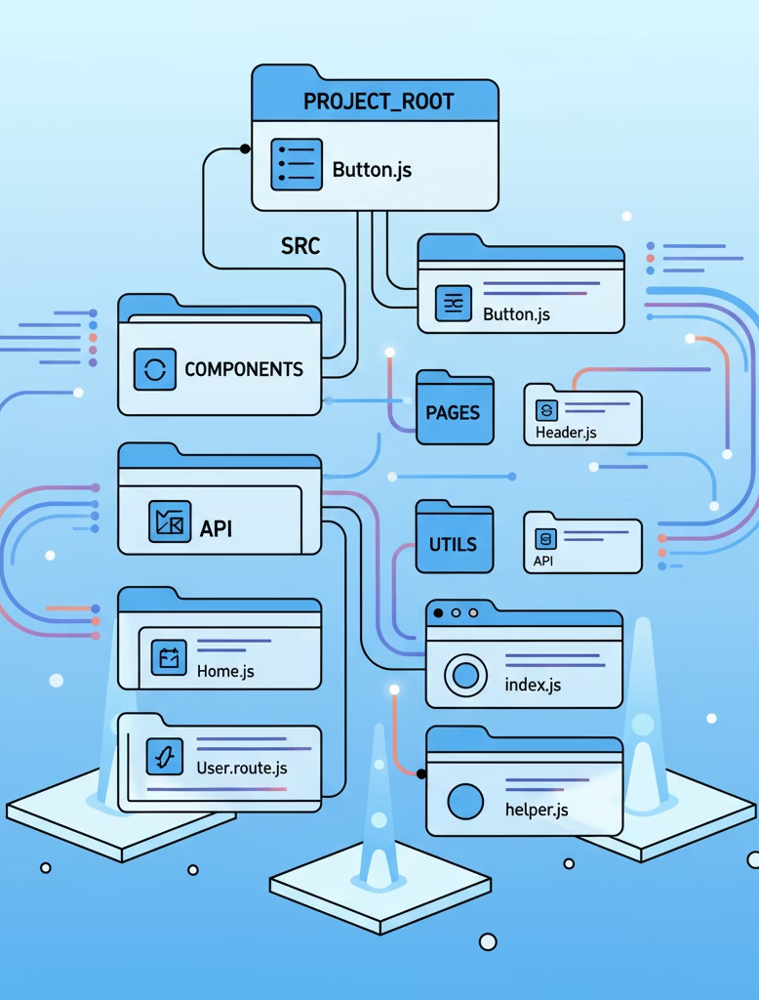

---

## Slide 17

Retain Context in a DOCS folder
Create a docs/ folder in your project to capture and organize information the agent can load later. Use different subfolders for specific 
types of .md files:
Rules (docs/rules/)
Reusable patterns or integrations (e.g., integrating Clerk + Convex). Store integration guides, coding standards, and 
architectural decisions.
Features (docs/features/)
Each feature has its own folder with spec.md and progress.md (e.g., docs/features/party-system/spec.md, 
docs/features/party-system/progress.md). Track requirements and implementation status.
Learnings (docs/learnings/)
Summaries of lessons discovered while solving problems. Capture solutions to tricky bugs, performance optimizations, and 
gotchas for future reference.
This structure gives the agent reliable context it can reference, just like an engineer would look at documentation.

---

## Slide 18

Managing context with claude.md
claude.md serves as a project guide, instructing Claude Code on your repository's conventions, 
scripts, entry points, and specific do's and don'ts. It's the central configuration for your AI agent.
/init command
Generate claude.md by asking Claude 
Code. It intelligently scans your 
repository and drafts an initial version, 
saving setup time.
Add claude.md for subfolders
Use a root claude.md for global context. 
Add additional claude.md files in 
subfolders for tailored instructions.
Dynamic Rule Loading
Reference docs/rules/* and 
docs/features/* in claude.md. Specify 
when Claude should consult 
documentation based on task type.
# [remember this for later]
Use # [whatever you want to remember] to 
tell Claude Code to remember 
information for the project or for your 
user profile.
* Don't write claude.md files yourself - let Claude Code generate and maintain them

---

## Slide 19

In AI-native development, agents iterate on tasks, guided by human review and feedback. This cycle refines agent performance over 
time.
Your goal: take yourself out of the loop as 
much as possible
AI Generation
AI agents generate initial solutions or 
code based on tasks.
Human Verification
Humans review and validate the agent's 
output for accuracy.

---

## Slide 20

What is MCP: 
Model Context Protocol
Model Context Protocols (MCPs) are standardized interfaces that act like a 
universal adapter, much like a USB-C cable, connecting your AI agents to 
development environments.

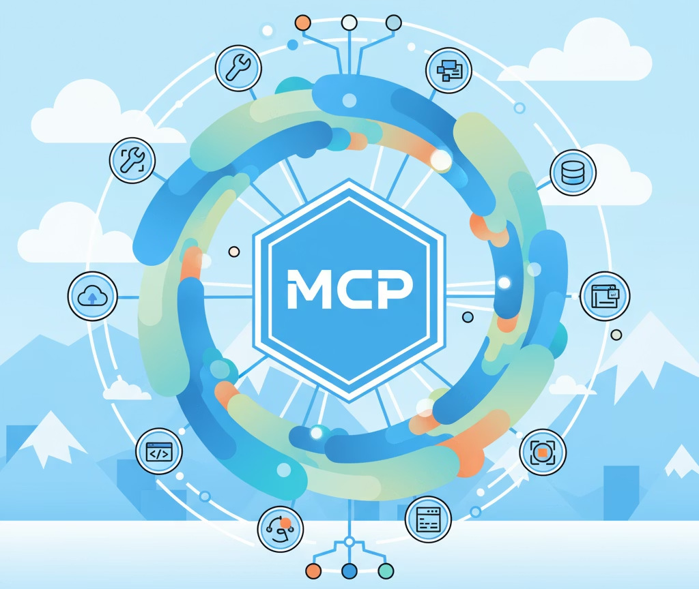

---

## Slide 21

Popular MCPs for Coding Agents
Browser Automation and QA
Use Playwright for automated browser 
testing, taking screenshots, and UI 
verification.
Code & Document Search
Leverage Context7 for semantic search 
across codebases and documentation.
Design Tool Access
Access design files, component 
specifications, and extract assets with 
Figma.
AI Consultation
Zen allows agents to consult other AI 
models for second opinions when facing 
challenges.
Database & Real-time Data
Integrate with Supabase for database 
queries, schema inspection, and auth 
management. For real-time operations, 
function calls, and file storage, use Convex.
Version Control
Manage repositories, review pull requests, 
and track issues through GitHub.
Find more at the MCP Registry or search for @modelcontextprotocol/server-* packages.

---

## Slide 22

Claude Code: MCP Configuration
claude mcp add server-name --scope 
project
1
Adding MCPs to Claude Code
Add custom tools via MCP:
Verify: claude mcp list
2
Scope Levels: Where Configs Live
Project Scope:
Current project only
Config: .mcp.json at repo root
Shared via git
Global Scope:
All projects
Config: ~/.config/claude/mcp.json
Personal utilities
D
 Project for team tools, 
Global for personal tools
3
Subagent-Specific MCPs
Target MCPs to specific subagents:
Example: QA Subagent → Testing 
MCP only
Benefit: ✓ Less context overhead
✓ Better performance
Quick Reference:
Add: claude mcp add <name> --scope <project|user>
List: claude mcp list
Config locations: Project .mcp.json | Global ~/.config/claude/mcp.json

---

## Slide 23

Claude Code: Clear and Compact Context Window
The agent operates within a limited context window (200k tokens for Claude Code), so managing this context is crucial to ensure it 
remains effective and relevant.
/clear
Reset context when the agent is looping or the history is 
polluted. Use when you want a fresh start without any 
previous conversation context.
/compact
Summarize and prune history to lower token use while 
keeping continuity. Use for long sessions where you still want 
recent context but need to free up space.
Subagents
Assign focused subagents (e.g., QA, frontend, backend) to 
keep contexts isolated; each subagent has its own window, 
reducing token pressure and cross-talk. Use /agents to list and 
switch subagents.
Continue Sessions
Continue from your last session via the app's Resume/Recent. 
If your CLI supports it, use a continue flag (e.g., -c).

---

## Slide 24

Claude Code: Subagents
Claude Code allows creation of specialized subagents for QA, frontend, 
backend, etc. Each gets its own context and MCPs, so they can focus on 
different parts of the system.
Frontend Agent
Specialized in UI/UX 
components, styling, and user 
interactions. Maintains context 
about design systems and 
component libraries.
Backend Agent
Focused on APIs, databases, 
and server logic. Understands 
data models and business 
logic patterns.
QA Agent
Dedicated to testing, quality assurance, and bug detection. Maintains 
testing standards and automation patterns.
To create or start a subagent, simply use the command claude start 
[agent_name]. All subagent configurations are conveniently stored in the 
.claude/agents/ directory, allowing for easy management and customization.

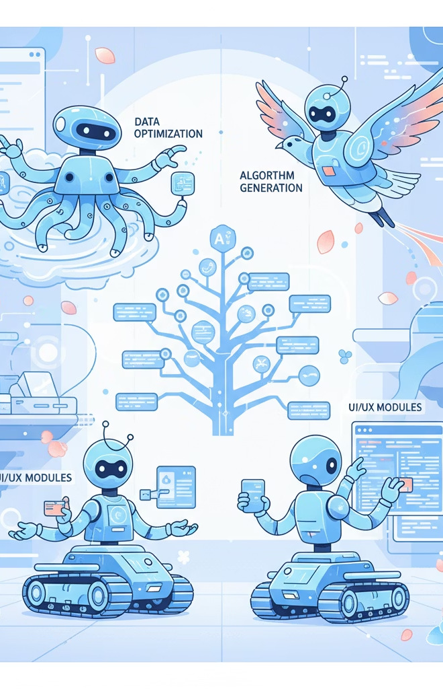

---

## Slide 25

Subagent Example: Pattern Extractor
The Pattern Extractor is an open-source subagent I created and released to research how specific patterns or features are implemented 
in other projects or repositories. It gathers this crucial context, enabling your main agent to apply proven solutions to the current 
project.
Targeted Research
Spins out a dedicated subagent to 
investigate specific code patterns or 
feature implementations in external 
repositories.
Fresh Context Window
Each Pattern Extractor subagent 
operates with its own clean context 
window, preventing token overflow 
and ensuring focused analysis.
Optimized Knowledge Transfer
Only the essential findings and 
gathered context are returned to the 
main agent, keeping its context 
window lean and relevant.
Find the Pattern Extractor on GitHub: github.com/hypersocialinc/claude-code-agents

---

## Slide 26

Claude Code: Custom Commands
In Claude Code, store commands in .claude/commands/[...md] so you can run /start-feature, /review, /commit-merge, etc. The agent reads 
the file and executes accordingly. You can ask claude code to create these commands.
/start-feature
Initializes a new feature branch, creates 
necessary folders, and sets up 
boilerplate code according to your 
project patterns.
/fix-linter
Analyzes and automatically fixes linting 
errors and code formatting issues to 
ensure adherence to code quality 
standards.
/commit-merge
Stages changes, creates descriptive 
commit messages, and handles merge 
operations with conflict resolution.

---

## Slide 27

Claude Code Hooks
Claude Code supports hooks that trigger follow-up actions once a task is 
complete (e.g., run tests, send TTS notifications, or auto-review code).
1
Code Completion
Agent finishes implementing a feature
2
Automated Testing
Hook triggers test suite execution
3
Quality Review
Code review and notification processes
4
Deployment
Automated deployment if all checks pass

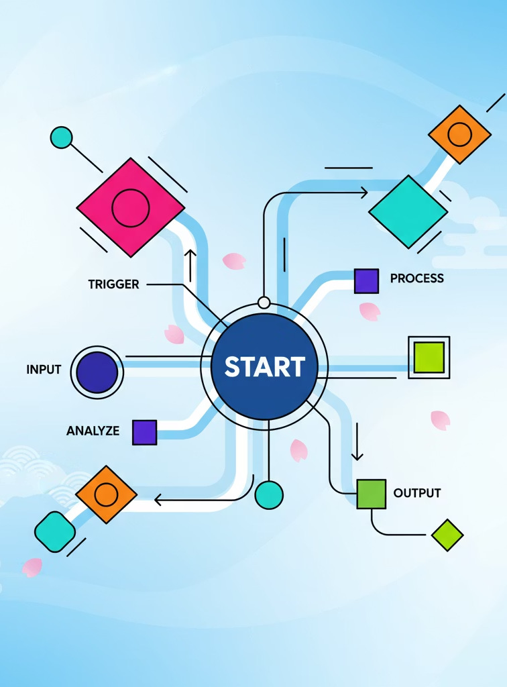

---

## Slide 28

Claude Skills: When Context Needs to Persist
Skills are markdown files that teach Claude domain-specific knowledge and workflows. Unlike hooks (automatic triggers) or subagents 
(delegated tasks), skills are progressive context that Claude loads on-demand.
When to use Skills:
Complex Workflows
For multi-step processes repeated often (e.g., "how we 
deploy to prod").
Domain Knowledge
Specific information too extensive or niche for CLAUDE.md.
Team Conventions
Detailed explanations of team standards and best practices.
Tool-Specific Patterns
Documentation of your Convex schema or API patterns.
Skills vs. Custom Commands
Commands: Shortcuts to trigger actions ("do X now").
Skills: Knowledge Claude references ("how to do X well").
Skills vs. Subagents
Subagents: Isolated workers for parallel tasks.
Skills: Shared context any agent can load.
D
 Pro tip: Skills load progressively—Claude reads them when relevant, not all upfront. This keeps context lean while making 
deep knowledge available.

---

## Slide 29

Case Study: Building a Music Production Skill
For TapJam's music agent, a comprehensive skill library was developed to teach Claude music theory, production techniques, and style-
specific patterns for Strudel live coding.
/skills/music-agent/
├── SKILL.md
├── theory/
│   ├── scales-modes.md
│   ├── chord-progressions.md
│   └── rhythm-patterns.md
├── styles/
│   ├── house.md
│   ├── ambient.md
│   ├── drum-and-bass.md
│   └── lo-fi-hip-hop.md
├── strudel/
│   ├── syntax-reference.md
│   ├── sample-libraries.md
│   └── effects-chains.md
└── examples/
This skill library totals approximately 70,000 tokens – a size that 
would be impossible to manage as a static system prompt or 
CLAUDE.md rule without exceeding context limits.
Progressive Disclosure
User asks for "chill lo-fi beat"
→ Agent loads lo-fi-hip-hop.md + chord-progressions.md
On-Demand Context
User asks for "intense DnB drop"
→ Agent loads drum-and-bass.md + rhythm-patterns.md
The agent only loads what it needs, when it needs it, keeping the 
context window lean and focused.

---

## Slide 30

Getting the agent to loop until you get it done
This capability is not Claude-specific. With the right context and tools, most terminal agents can loop until a task is done (e.g., build → 
test → fix cycles). Combine this with MCPs for QA or databases so the agent continuously tests and refines.
Common Loop Patterns
Build Fixing
Loop until the project successfully 
builds—agent reads compiler errors, 
fixes code, runs build again, repeats 
until clean.
Frontend Testing
Loop when fixing UI bugs by using the 
Playwright MCP to test changes—agent 
modifies code, runs automated tests, 
checks screenshots/assertions, fixes 
issues, repeats.
Backend Development
Loop when building database features 
using Supabase or Convex MCPs—agent 
writes backend code, queries the 
database to verify data 
structure/operations, adjusts logic, tests 
again until correct.

---

## Slide 31

Keep Feature Scope Small, Commit Frequently
Leverage agents effectively by following these best practices for clear communication and structured progress.
Build Small, Testable Features
Break features into small, testable units. This reduces 
complexity and boosts agent success.
Start in Plan Mode
Begin tasks in plan mode to align with the agent. Refine the 
plan for clarity before execution.
Document Specs & Progress
Have Claude generate and update specs and reports in .md 
files. This keeps documentation current.
Commit Frequently
Use /commit regularly for small, atomic changes. Frequent 
commits track progress and ease collaboration.

---

## Slide 32

Picking the Right Model for the Task
Both terminal agents let you switch models (e.g., using the /models command), and IDEs like 
Cursor allow choosing which model powers completions.
Heavy Models
Use for complex, multi-step reasoning and 
architecture work. Better for planning, 
design decisions, and solving intricate 
problems.
Light Models
Prefer for speed, iteration, and cost 
efficiency. Ideal for simple edits, repetitive 
tasks, and quick feedback loops.
Default Strategy
Start light; escalate only when blocked or quality demands it. This optimizes both cost and 
development velocity.

---

## Slide 33

Asking the Model to Think
When you need deeper reasoning, add cues in your prompt:
think
Normal depth reasoning for standard problem-solving
think more
Slower, more detailed steps for complex issues
ultrathink
Maximum reasoning, high token/time cost for critical decisions
Use these for design decisions, migrations, or root-cause analysis where quality trumps speed.

---

## Slide 34

What to do when the agent is stuck
Even the best agents occasionally get stuck or produce suboptimal results. Here are strategies to 
get back on track:
Reset Context
Use /clear to reset context and have the agent take another crack. This eliminates any 
confusion from previous conversation history.
Switch Agents
Move from Codex to Claude, or vice versa. Different agents have different strengths and may 
approach the problem differently.
Consult Other Models
Use MCPs like Zen MCP to let the agent consult other models for second or third opinions 
on complex problems.
Ask the Agent to THINK MORE
Explicitly ask the agent to think more or even go into ultrathink mode in your prompt. This 
pushes it to generate deeper reasoning chains when it feels stuck.

---

## Slide 35

Designing with AI Agents
Prototype Features
Have the AI build and prototype features until you're satisfied with the design and 
functionality. Iterate quickly to find the right patterns.
Extract Components into a UI Library
Extract successful patterns into reusable components and add them to your UI library. 
Document the design decisions and usage guidelines.
Build Design System
Over time, you create a custom design system that reflects your product's unique needs and 
maintains consistency across features.
Guide Future Development
Point future agents to your UI library—they'll build consistent designs using your established 
components and patterns.

---

## Slide 36

Starting with a UI Library Foundation
Kickstart your design system by leveraging battle-tested UI libraries. These provide accessible, unstyled, or pre-styled primitives that you 
can customize to fit your product's unique aesthetic and functional needs.
Radix UI Primitives (React)
A set of low-level, unstyled components for building high-quality, 
accessible design systems. Ideal for full control over styling.
shadcn/ui (React)
Not a traditional library, but a collection of customizable, re-usable 
components that you can copy directly into your codebase.
Headless UI (React)
Completely unstyled, fully accessible UI components, designed to 
seamlessly integrate with utility-first CSS frameworks like Tailwind 
CSS.
Tamagui (React Native)
A universal UI kit offering powerful styling and performance 
optimizations for both React Native and web applications from a 
single codebase.

---

## Slide 37

Environment Setup with Agents
Leverage AI agents to rapidly configure development environments, streamlining setup and minimizing manual debugging.
Project Bootstrapping
An agent can quickly bootstrap new web (React, Vue, Angular) 
or mobile (iOS, Android) projects, handling initial setup, 
tooling, and basic configurations.
Automated Troubleshooting
If setup issues arise, the AI agent interprets logs and 
automatically fixes common problems like version conflicts, 
missing dependencies, PATH issues, or misconfigurations, 
significantly faster than manual debugging.
Dependency & Package Management
Agents intelligently clone repositories, install dependencies, 
and select compatible libraries (e.g., npm, pip, cargo), 
eliminating time-consuming manual research and 
dependency hell.
Integrated Testing
AI can run test suites, interpret failures, and set up testing 
frameworks (e.g., Jest, Pytest) from scratch, ensuring a high-
quality codebase from the start.

---

## Slide 38

Refactoring Made Easy with AI Agents 
Big refactors, once daunting for small teams, become practical with AI agents as copilots, enabling significant transformations with 
unprecedented efficiency.
Systematic Code Changes
Perform large-scale code 
transformations (e.g., API updates, 
converting class to function 
components) with precision across 
many files.
Legacy Cleanup & Modernization
Automate updates for dependencies, 
coding patterns, and error handling, 
bringing older codebases up to 
modern standards.
Database Migrations
Generate and execute complex data 
move, transform, and load scripts for 
seamless database schema changes, 
ensuring data integrity.

---

## Slide 39

Working with Developer Docs
Optimize AI agent performance and consistency by systematically managing 
your project documentation and reusable knowledge.
1
Integrate External Documentation
Use `llms.txt` or `.md` files from dev tools. Paste to agents or save to 
`docs/rules/` for persistent access.
2
Automate Context Retrieval
Reference documentation rules from `claude.md` or `agents.md` to 
automate relevant context retrieval for AI agents.
3
Capture Integration Details in Docs
Document tool/service integrations in `docs/rules/[integration].md` 
to build a reusable knowledge base for your team and AI agents.
4
Use MCPs like Context7
MCPs (e.g., Context7, Exa Code) help agents retrieve developer docs 
more easily.

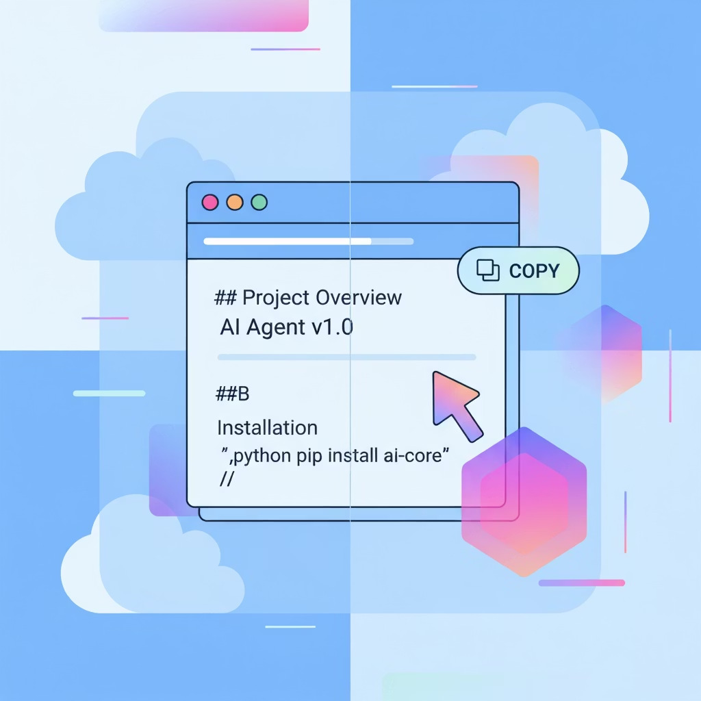

---

## Slide 40

Working on Multiple Features in Parallel
While an agent is looping, it may take anywhere from 2 minutes to 10–15 minutes to complete. Working on multiple features in parallel 
can help make better use of that downtime.
01
Multiple Agent Tabs
You can run distinct agents in separate tabs, each focused on a 
different feature. This allows progress in parallel, though agents 
can sometimes step on each other's toes if working on the same 
files.
02
Separate Projects
Another approach is to have agents handle entirely separate 
projects or repos. This avoids conflicts and keeps progress isolated.
03
Git Worktrees
A better method is to use git worktrees: replicate your project into 
a subfolder tied to a branch. Work in isolation, then merge back 
when ready.
04
Tools like Conductor.build
Tools like Conductor.build make this easier by automating the 
process of setting up new worktrees, running build scripts, 
managing them in parallel, and merging results with AI assistance. 
It currently works with Claude Code, not Codex. You can try it here: 
https://conductor.build.

---

## Slide 41

Example: Cursor Agents Mode
Cursor allows users to switch between "Agents" and "Editor" (classic) mode. On Agents mode, developers can spin out multiple agents 
working in parallel, as individual threads on the left panel.

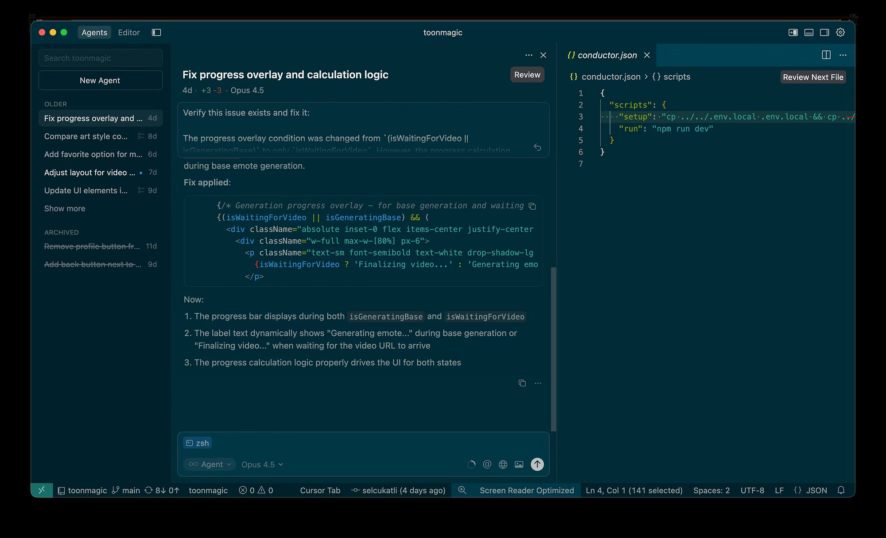

---

## Slide 42

Example: AntiGravity
AntiGravity is a new IDE by Google - that is also a VS Code fork, and provides a similar agents view like Cursor. The unique improvement 
is that it allows developers to spin out multiple agents across different workspaces. When agents are done, an update drops on the 
inbox.

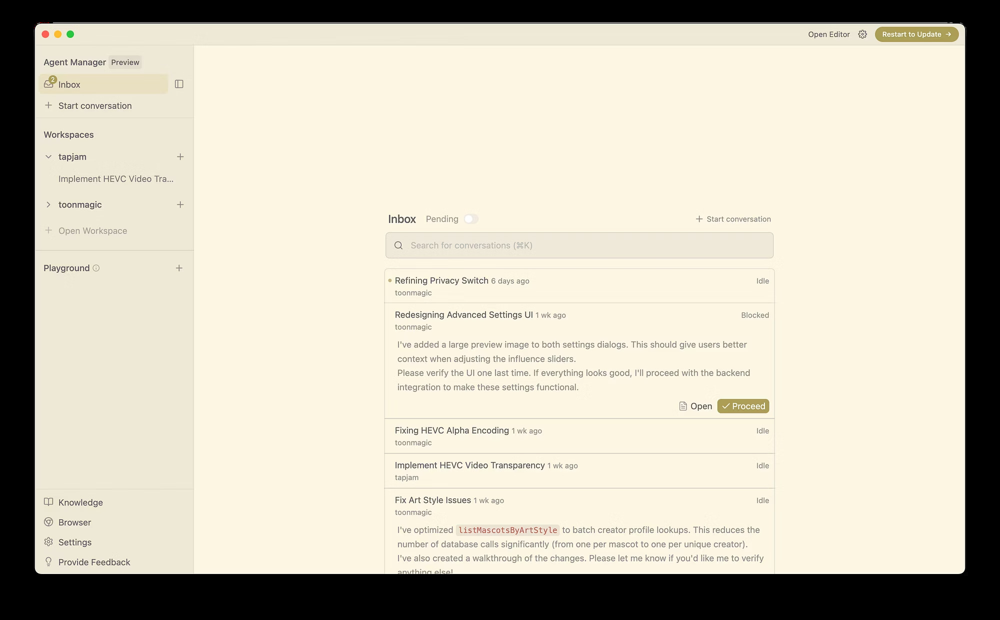

---

## Slide 43

Example: Conductor.build
Conductor spins up isolated git workspaces in the cloud—each agent gets its own branch, full codebase access, and can work 
independently without conflicts.
Since agents operate on real git worktrees, you can parallelize across multiple repos, review diffs, and merge when ready. Think CI/CD for 
AI agents.

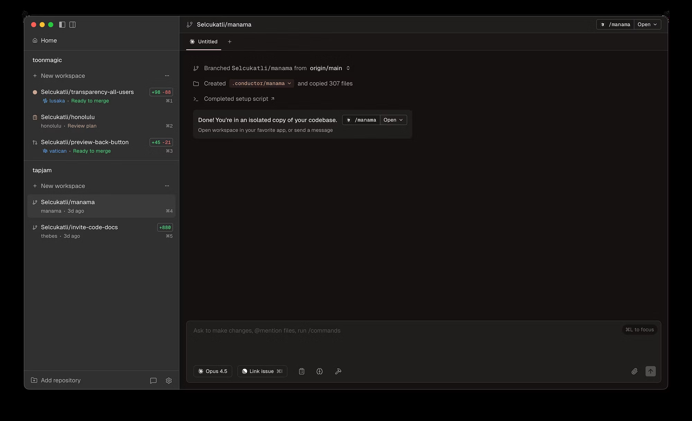

---

## Slide 44

Code Reviews 
AI agents can enhance the entire code review and collaboration process, from initial review to final merge.
Review locally with Agents
Agents can review each other's code: e.g., Claude Code 
reviewing Codex output. Both Claude and Codex now has a 
/review command for streamlined PR reviews. 
Use CodeRabbit for PR Reviews
AI can help with merge conflicts and PR drafts, with 
humans in the loop. MCPs like Coderabbit can assist with 
automated reviews and suggestions.

---

## Slide 45

Code Reviews
AI agents can enhance the entire code review and collaboration process, from initial review to final merge.
Review Locally with Agents
Have one agent review another's work: Agent A finishes a task 
and opens a PR, then spin up Agent B (Claude Code or Codex) 
in a new tab to review it—adding comments, flagging issues. 
You can jump in and discuss. Agent A then pulls the feedback 
and addresses it.
Use CodeRabbit for PR Reviews
For teams already using GitHub/GitLab workflows, CodeRabbit 
integrates directly into your PR process—automated reviews, 
inline suggestions, and merge conflict help without spinning 
up local agents.

---

## Slide 46

Speech-to-Text for Flow
Integrating speech-to-text tools into your AI-native coding workflow can significantly boost productivity and maintain focus, allowing 
you to articulate ideas and commands naturally.
Hands-Free Coding
Dictate code, commands, and comments, freeing your hands 
for navigation or other tasks. This reduces friction and allows 
for continuous thought flow, similar to how a musician plays 
an instrument.
Streamlined Documentation
Effortlessly generate comprehensive documentation, commit 
messages, or task descriptions by speaking them directly, 
reducing typing overhead and ensuring clarity. This also helps 
in creating detailed notes for future reference.
Enhanced Accessibility
Provides an alternative input method for developers with 
physical impairments, making coding more inclusive and 
accessible to a wider talent pool.
Improved Focus & Ergonomics
By minimizing keyboard and mouse interaction, developers 
can maintain focus on the problem at hand, reducing 
cognitive load and potential for repetitive strain injuries.

---

## Slide 47

Speech-to-Text for Flow
Integrating AI-powered speech-to-text allows developers to maintain deep 
focus, reducing context switching and keeping their hands on the keyboard for 
critical tasks.
Uninterrupted Focus
Dictate comments, 
documentation, and even small 
code snippets directly, 
eliminating the need to break 
your thought process to type.
Voice-Activated Commands
Execute common IDE actions, 
navigate files, or trigger builds 
using natural language 
commands, keeping your hands 
free and eyes on the code.
Enhanced Accessibility
Provides a valuable tool for 
developers with physical 
limitations, enabling them to 
contribute effectively without 
traditional typing constraints.

---

## Slide 48

Speech-to-Text for Flow
Integrate speech-to-text directly into your development workflow to maintain 
focus and efficiency, especially for complex tasks.
Uninterrupted Input
Leverage Wispr Flow (https://wisprflow.ai/) for direct speech-to-text 
input to agents, eliminating the need to break your coding rhythm to 
type.
Natural Command
Dictate complex requirements, walk through intricate logic, or describe 
bugs verbally, all while staying within your IDE.
Hands-Free Productivity
Especially beneficial for longer prompts or when your hands are 
occupied with other physical tasks, keeping your thoughts flowing.
Sustained Focus
Prevent context-switching and maintain development momentum by 
speaking detailed explanations instead of typing them out.

---

## Slide 49

Comparing Terminal Agents
1
Claude Code
The most feature-rich for engineering 
workflows, providing tailored support 
for developers.
Subagents, custom commands, 
robust MCP support.
200k token context window.
Reliable for daily use and great for 
repository navigation.
2
Codex
A highly capable alternative, useful for 
overcoming challenges where Claude 
Code might stall.
Often "overthinks" tasks; lacks 
custom commands and has weaker 
MCP support.
~1M token context window, ideal for 
large diffs or multi-file contexts.
3
Gemini CLI
Offers solid performance with a large 
context window, making it a powerful 
utility.
~1M token context window.
Can be integrated as a tool for 
Claude Code to invoke as needed.
Practical Advice for Agent Use
Leverage Multiple Agents
Don't rely on a single agent. If one struggles with a task, 
switch to another to see if it can unblock the situation.
Maintain Consistent Context
Ensure all agents share the same repository context and 
relevant artifacts (e.g., diffs, error logs, screenshots) to 
enable collaborative building.

---

## Slide 50

Picking the Right Stack Matters
Transitioning from microservices to a single monorepo dramatically changed our team's operational efficiency, especially for a small 
team leveraging AI agents.
Reduced Coordination Costs
Simplified team collaboration and 
minimized overhead by having all code 
in one place.
Simplified CI/CD
Automated and streamlined build, test, 
and deployment pipelines across the 
entire application stack.
Full Context for Agents
AI agents gained a holistic view of 
frontend, backend, and infrastructure, 
enabling smarter, more integrated 
decisions.
Faster Local Development
Rapid setup and iteration cycles significantly improved 
developer productivity.
Faster Refactoring
Large-scale code transformations became efficient and less 
error-prone with unified visibility.

---

## Slide 51

Our Stack (and why)
Next.js — Web apps
File-based routing, React Server Components, and great DX. Works well with AI agents because patterns are predictable and 
discoverable. CI and deployment via Vercel (auto previews, envs, simple rollbacks).
Expo — Cross‐platform mobile
Unified toolchain, OTA updates, and strong ecosystem. Lets a small team ship mobile features quickly without duplicating 
effort across iOS and Android.
Swift — Native iOS
Used when we need platform‐specific performance or UX. We keep native modules alongside Expo when it's the pragmatic 
choice for performance-critical features.
Convex — Backend + database
We moved off Postgres/Supabase to keep application logic and data access in the monorepo with type‐safe functions. No 
separate repos or edge functions to synchronize.
Clerk — Authentication
Managed auth with good DX, web/mobile SDKs, and sane defaults for sessions and MFA. Keeps auth concerns consistent 
across Next.js, Expo, and Swift.
AI Frameworks — Vercel AI SDK & BAML
Vercel AI SDK for streaming responses and tool calling in Next.js. BAML for structured LLM outputs with type safety. Both 
integrate well with our monorepo approach and provide reliable AI integration patterns.
This stack lets two engineers cover web, mobile, and backend with minimal glue code, faster iterations, and clear ownership.

---

## Slide 52

Key Takeaways
Don't vibe code, get in the 
weeds
Know how AI agents and tools work 
internally. This helps with 
debugging, prompt engineering, 
and maximizing their potential.
Get out of the agent's way
Set clear goals, provide full context, 
and integrate tools. Let agents run 
autonomously, minimizing manual 
intervention.
Generate and review code
Focus on guiding AI to generate 
code. Review and refine it to meet 
quality standards, instead of writing 
every line manually.
Organize your code to make it easy for agents
Design clear, modular code with explicit interfaces. Good 
code helps agents understand, modify, and extend 
functions better.
The space is moving fast, keep yourself up to date
Follow X, Hacker News, and tech pubs. Keep current with AI 
advancements, discovering new tools, techniques, and 
breakthroughs.

---

## Slide 53

Questions?
selcuk.atli@gmail.com

